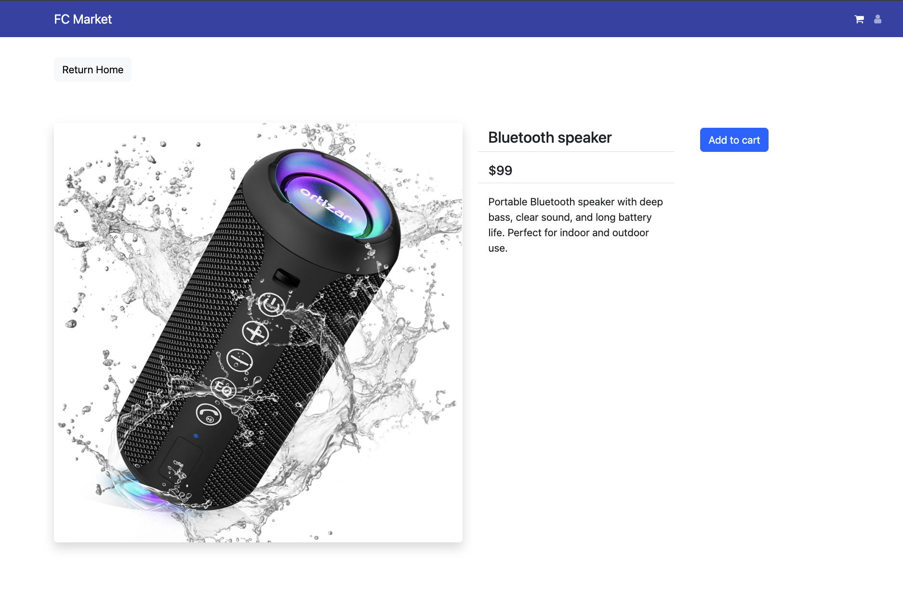
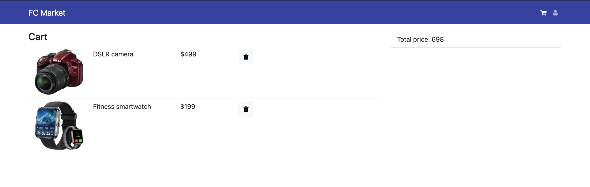

# 🛒 FC Market

FC Market is a small e-commerce app I built to practice connecting a React/Redux frontend to a real backend instead of just working off static data. It's got a product catalog, a product detail page, and a shopping cart that actually persists if you refresh the page.

There's no database, the backend just serves product data from a JS array, but the frontend talks to it exactly like it would talk to a real API, which was the point.

## 🎥 **Demo video:**
<!-- https://github.com/user-attachments/assets/REPLACE_WITH_YOUR_UPLOAD_ID -->
[https://github.com/user-attachments/assets/5b1be73f-32a8-4e64-b36e-21890f6d9ae2](https://github.com/user-attachments/assets/cb4bb300-67a5-4a40-9d21-c802c5d5fcb6)


## 📸  **Screenshots:**

**product listing page**
<!---->


**Product detail page**
<!---->


**Total price page**
<!---->


## What it does

- Loads products from the backend instead of a hardcoded file
- Product detail pages for each item
- Add/remove items from a cart, with the total updating automatically
- Cart survives a page refresh (saved to `localStorage`)
- Basic responsive layout using React-Bootstrap

## Stack

**Frontend:** React (Vite), Redux + Redux Thunk, React Router, React-Bootstrap, Axios

**Backend:** Node + Express, Nodemon for dev

I split it into two folders (`frontend` and `backend`) since they run as two completely separate servers.

## Running it locally

You need both servers running at the same time, in two different terminals. Start the backend first, otherwise the homepage will just sit there loading until you refresh it.

```bash
git clone https://github.com/AhsantMozhgan/FC-Market-React-Redux.git
cd FC-Market-React-Redux
```

**Backend:**
```bash
cd backend
npm install
npm start
```
Runs on `localhost:8000`.

**Frontend:**
```bash
cd frontend
npm install
npm run dev
```
Runs on `localhost:5173` (Vite will bump to 5174 if that port's already taken).

> `node_modules/` is excluded via `.gitignore` — running `npm install` regenerates it, nothing extra to do.

## API

Nothing fancy, just two endpoints:

```
GET /api/products       → all products
GET /api/products/:id   → one product
```

## Routes

| Route | What it shows |
|-------|----------------|
| `/` | Home page, product listing |
| `/product/:id` | Product detail |
| `/cart/:id?` | Cart page — visiting with an id (e.g. `/cart/3`) adds that product on load |

## Project Structure

```
FC-Market-React-Redux/
├── frontend/
│   └── src/
│       ├── action/       # Redux async action creators
│       ├── reducer/      # Redux reducers
│       ├── components/   # Reusable UI (Header, Footer, Product)
│       └── pages/        # Route-level views (Home, Product, Cart)
└── backend/
    ├── routes/
    ├── controllers/
    └── models/
```

## Author

**Mozhgan Ahsant**
